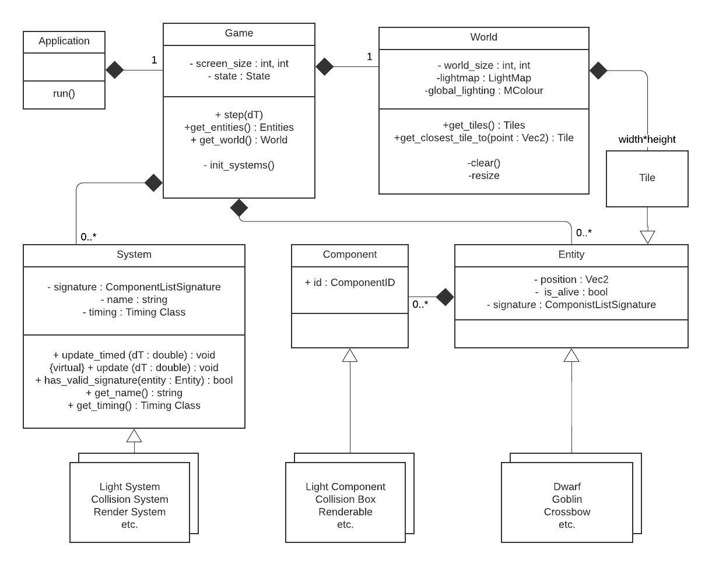
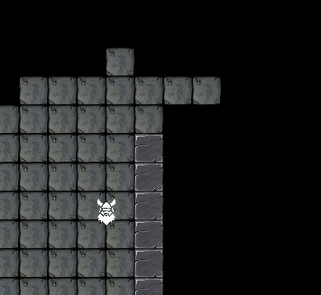
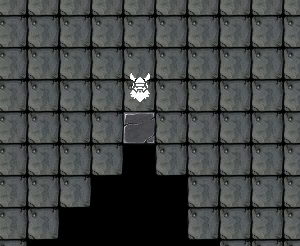
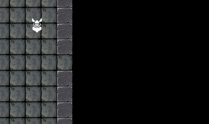
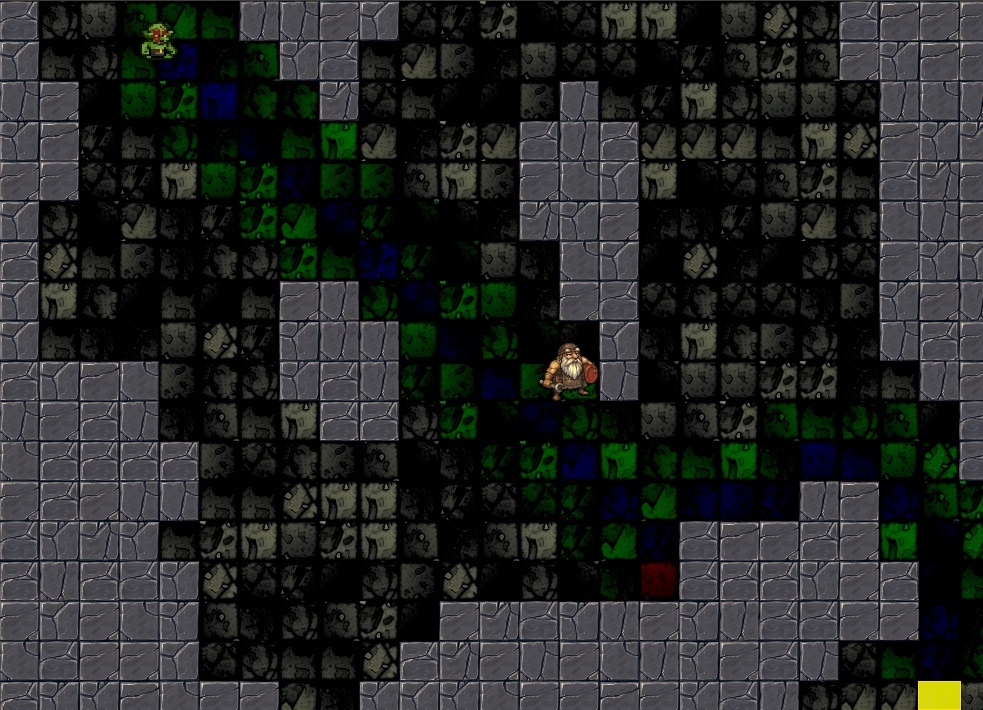

# Dwarfs Of Light
This is an from-the-ground-up implementation of a Entity Component System based game engine, with a game built on top of it. The game is about dwarfs walking around in a dark cave with torches and dynamic lighting. The goal is to learn more about C++ containers, smart pointers, memory management, and hopefully templates.


### Below is a quick showcase about the game


The **world** where the ecosystem is turned off. Note pathfinding of the wandering goblins, and the raytracing creating dark shadows.


The **ecosystem** at `5x` speed. As you might note, this is still unstable. Who though it would be complex to mimic life?


<sup>The fact that it's based on dwarfs in a cave has nothing to do with the fact that I've been playing a lot of Dwarf Fortress lately.</sup>


Below is typical timing information for a fully populated world per update with no optimization.
```
Timing Information:     last    min     max    [ms]:
       Moving System:   0.000   0.000   0.002
     Lighting System:   0.031   0.002   0.045
       Render System:   0.014   0.005   0.089
        Input System:   0.000   0.000   0.004
         Team System:   0.001   0.000   0.001
         Life System:   0.004   0.000   0.005
           AI System:   0.000   0.000   0.000
  Pathfinding System:   0.001   0.000   0.013
       Moving System:   0.000   0.000   0.000
    Collision System:   0.002   0.000   0.003
```

## Entity Component System Explained

Game design architecture is a very important aspect of game design. This is because games are typically full of different kinds of objects that interact with multiple other kinds of objects in multiple different ways. This quickly and easily turns your code into spaghetti. The Entity Component System (also called ECS) attempts to solve this. This architecture is widely used today in large projects, like `Unreal`, `Overwatch`, `Unity`, etc.

The idea is to split your architecture into three categories. First you have **entities** (like goblins, projectiles, etc) who's functionality is described by list of **components** (like renderable, collision box, light source). Then there's a list of **Systems** that only interacts with the `components` that is applicable to it (like a Rendering `System` only cares about `entities` with a renderable `component`). An important aspect of this is that `components` has no functionality, and `systems` has no state.

For example, in my current implementation, my `Dwarf` needs to bump into walls so it has a collision box `component` which *only* contains the collision box shape. Then there's a Collision System which only runs collision checks on `entities` with the collision box `component` and handles any collisions. If it didn't have the collision box `component` the Collision system would simply ignore it.

Below is a UML Class Diagram of how I layed out my ECS architecture:



Here is an example of how simple it is to define a `Dwarf` with this architecture:

```
// Some includes...

class Dwarf : public Entity{

private:
    double width = 1.5;
    double height = 1.5;
    std::string m_texture_path = "textures/dwarf2.jpg";

public:
    Dwarf(double x, double y) : Entity("Dwarf") {
        this->add_component<TransformComponent>(Vec2(x, y));
        this->add_component<Renderable>(m_texture_path, width, height);
        this->add_component<ControllerComponent>(5);
        this->add_component<CollisionBox>(width, height);
        this->add_component<LightComponent>(MColour(230, 180, 180), MColour(20, 20, 0), 1, 20);
    }
};
```

and my main update loop is:

```
bool Game::update(double dT){
    for (auto &system : m_systems){
        system->update_timed(dT);   // <update_timed> measures the update duration
    }
    return m_state != e_quit;       // This state can be changed by systems
}
```


My implementation is not a *pure* ECS implementation, although I try to stay close to the ECS design philosophies as much as possible. This is still a side project, and development time is a big factor in design choices, even in industry.

It should also be noted that my implemented architecture is not ideal. Ideally you would want all `components` stored in `Game` (and not in `Entity`). Then the `System` would simply loop through these `Components`, not caring to which `entity` it belongs. A big advantage to this would be that most of the data (which typically lives in `Components`) will be stored **serially**, making it much faster to read because cache will be on your side. In my system `components` are scattered throughout memory. However, on the small scale of **this** project this effect will hardly be measurable.

---
## Problems Solved
- **Circular Dependancy** between `Game` and `Systems`, where both need to access the other's members. The solution was to tell the compiler how much memory to allocate in the header using a forward declaration. Then, with the implementation a simple `include` can be used, since the memory is already allocated and the circular dependancy is solved.
  - Only store pointer or reference to the other class.
  - `Game.h` includes `System.h` *outside* the include guards.
  - `System.h` forward declares `Game.h` above the header definition.
  - In the `System.cpp` source file `#include "Game.h"` right below the `#include "System.h`.
- **Compile Time**: With [this commit](https://github.com/heinwessels/DwarfsOfLight/commit/acd40b6cc2276150c46059bfbf930e58789daf1e) I decreased the compile time from almost **22** seconds to almost **14** seconds. I did this by using `forward declarations` where possible (sometimes forcing it by changing to pointers), and if possible only placing `#includes`s in `.cpp` files. At the start of the project I did not know of the effect of `#includes`, but it has a massive effect on development time, and would have gotten worse the larger the project becomes.
- **Using Templates to Reduce Errors:** Changed the `entity`to use **templates** when working `components` (instead of `ID`). This not only does more processing at compile time, but removes a possible user error. With the old method it was easy to `static_cast` the pointer to a *invalid* class with no compile or runtime errors. Below is an examples of how this improved the coding style to be more secure, and eliminates the knowledge of `IDs` from the user:
  - **Before**:
    - create: `this->add_component(std::make_unique<TransformComponent>(Vec2(x, y)))`
    - get: `static_cast<TransformComponent&>(entity.get_component(TransformComponentID))`
  - **After**:
    - create: `this->add_component<TransformComponent>(Vec2(x, y))`
    - get: `entity.get_component<TransformComponent>()`

- **Collisions:** Designing a collision system for ECS isn't straight forward, seeing as different systems should be isolated. For example, an entity can have a `CollisionBox`-component. But where should it check collisions? If it's checked while moving it should be done in the `MovementSystem`, but then the `MovementSystem` will dependent on `CollisionBox` as well and not all entities that move will have a `CollisionBox`. Also, it will result in a `O(n^2)` instead of the possible `0.5*O(n^2)`. Therefore I have a `CollisionSystem` that executes *after* the `MovementSystem`. If a CollisionBox collides with another by overlapping, the system will move them apart again (using the shortest distance in one direction).
- **Storage of Entities, Components and Systems**:
  - **Entities** will be stored in a `std::list` in the `Game` class. This is good for random inserting, deleting and sorting. `Entities` will almost never be randomly accessed, and will typically be looped through with `iterators`, which is still fast. A possible downside is caching since the data won't be stored serially. However, the `Entity` only contains pointers to `components` (see next point), so it's already not great for caching. This list will also be sorted during rendering (for rendering order), which is very fast with `std::list` since it only changes pointers.
  - **Components** are currently stored in the `entity` it belongs to, in a `std::unorderer_map` of `std::unique_ptr`s. Storing it inside the `entity` is not ideal (see TODO #1), but was used for learn the ECS system. It's stored in a `std::unorderer_map` to have quick access by using a unique key (`ComponentTypeID`).
- **Floats vs. Doubles:** Initially the software was written using floats, and it worked well until ray tracing was implemented. Floats were unreliable on the edge cases, especially on the righthand side on the screen (largest `x` coordinates). Therefore, the change was made to doubles. This had no noticable impact on the speed, although it was not stress tested, and completely solved the unreliability issue on the ray tracing.
- **Global Texture Pool:** If possible entities should share textures (e.g. floor/wall tiles). Therefore, I implemented a texture pool from a `std::unordered_map` located in the `Render System`, with the `texture_path` as key and a texture-wrapper class as element. Each time a texture is requested it checks if it's in the texture pool. If it's not, then it creates a new entry with that path as key and loads the texture into `VRAM` (I think). This way a `Renderable Component` only needs to know it's texture's path and location on that texture (using index and number of row/columns), while the `system` handles the rest, which is true ECS design philosophy.
- **Occupancy Map:** In this game entity's proximity to one another is required often (collision, attack, reproduce, etc), and checking every entity each time in each system will become a lot of processing. Therefore, I implemented an occupancy map that stores a `std::list` or raw pointers to all entities on that specific tile. this makes it easier to all entities in a close region. A better way in the future could be to use a `quad_tree`.

---
## Optimizations Done

The optimization strategy is to implement the code so that it works well while keeping performance in mind, but not doing any optmizing. Then, if a certain system is starting to take too much time, run `kcachegrind` and determine which aspect of that system is the problem. Only then optimize.


### Light System
This is probably the largest load on the software. Running `kcachegrind` during this [commit](https://github.com/heinwessels/DwarfsOfLight/commit/899be58b134c4c1bf4eac7628c63089466bd259d) shows that `LightMap::zero` (35%) and `LightMap::operator+=` (30%) is the largest influences on the lighting system. Therefore I will do the following:
- ~~Changed `LightMap::zero` to use `fill` instead of a `for-loop`, this changed the usage 35% to 30%.~~ This was undone during the next step to rather have readability, since the problem was circumvented.
- `Lightmap` operations is the bottleneck because it was assumed every lightsource could possibly illuminate the entire map. This means for a `100x100` sized map it would require 10000 copy and 10000 zero operations for **every** lightsource. This was changed to only copy and zero a small range that the lights *could* illuminate, where the majority would be a `≈30` tiles for `Mushrooms` light. This took `LightMap` operations (zero and add) from being 70% of a global light update to 6%!
- **(TODO)** A bigger effect would be to add a flag to light components to calculate them by tile. This means looping over all tiles, only ray-trace light from the first *by-tile* lightsource it finds.
- Lastly, reduce the amount of rays to trace, although the actual ray-tracing algorithm does is only about 15% of time used.
  - The number of rays to emit will depend on how far the light will travel. This will ensure a small enough arc-step is used to light up all tiles far away. I found 200 rays at 15 blocks distance works well, which means I need an arclength of`(2π/200)*15 ≈	0.5 blocks`. This only increased the speed by about 4%.


---
## Detailed Descriptions

### Lighting Simulation

For this project I want to have the effect of a dwarf carrying a fire torch in a cave. Which means it will only light up the area around him, and cast a lot of shadows. Therefore, it would need some form of ray tracing to *not* light up blocks that's obscured. I saw two ways to achieve this.

#### Technique 1: Light Growing Algorithm

I thought a growing algorithm would suffuce, since the calculation will be done on large 2D discrete tiles. I've also always wanted to develop my own growing algorithm.

Therefore I defined a list of `Seeds`, which is only a tile coordinate. The first seeds is the light source tile, and each of it's neighbours. Then I will loop through this list of seeds and attempt to grow each one. A seed will only grow in certain conditions, and if creates more seeds successfully, then it's added to the main seed list. Then the main seed list is just looped until it's empty.

The initial rules I used was:
- New tile is not out of bounds of the map
- New tile has not already contain a seed
- New tile is within lighting distance from light source (do not like the squared distance calculation).

This works well enough, and only lights up the tiles within a certain distance. However, the light seems to bend around corners. This is due to the rough choice on which tiles are available to grow. This is visible in the two gifs below, where the dwarf-like entity is holding a light source. In this case the tile's brightness is not influences by die distance from the source.




<sup>**Please ignore the bad tileset colours.**</sup>

This is a good experiment, but for good looking lighting I believe the right way to go would be a form of ray tracing. In order to shape this growing algorithm to achieve the shadows I want will require hacking the solution so much that it's not a simple grower anymore. Therefore I will rewriting it.

#### Technique 2: Discrete Ray Tracing

I implemented a discrete ray tracing algorithm from scratch, and this achieved much better results!




<sup>**Please ignore the bad tileset colours.**</sup>

This was done by implementing a discrete lightmap, and every object in the game is illuminated according to this map. To propogate a ray through this map I only calculate the intersection with the next lightmap-tile's **border**, and continue doing this until the ray hits an obstacle or its max distance. This means no `n`-body collision detection, which makes it very fast. And it creates very real looking shadows. This is exactly the effect I desired, and was definitely worth the rewrite.

### Pathfinding

For pathfinding I implemented a A* algorithm from scratch using psuedo code. I store all `nodes` as `std::unique_ptr`s in the open and closed `std::lists`. This works, because when a node moves from open to closed, the address stays the same, meaning a `child` node knows where his `parent` is. I did not use a `std::priotity_queue` for ease of implementation, since it does not have iterators. For the weight calculation for each node (or the `h` metric) I simply used the euclidean distance. This is accurate, but could be improved to more efficient solutions.

My goal was to implement the pathfinding, and optimize later. The pathfinding in the picture below takes `<2 ms`. If requried later I could improve this by:
- Implement (or mimic) a `std::priotity_queue` to avoid looping.
- For `h` use the Manhatten distance, or approximate the hypotenuse.


<sup><b>Example of pathfinding calculation. It has been adapted to not go diagonally accross corners, which is more visible in the gif below.</b></sup>

This is also where the ECS architecture excels, because I can finely adjust how and when the engine does pathfinding. Currently I can limit the amount of pathfinding calculations per `update` easily. The process for a entity to pathfind is as follows:

1. An `component` requires the entity to move somewhere (e.g. AI).
2. This sets the pathfinding `component` to `pathfind requested`.
3. The pathfinding `system` then loops through all pathfinding `components`, and calculates a specified amount
4. Any pathfinding requests thats left will be calculated in the next update.


<sup><b>A lonely Goblin wandering around aimlessly.</b></sup>

### Ecosystem
My goal for this program is to have a rough ecosystem running. However, as life is complex, and balancing is an issue. My goal is to have the ecosystem consist of three parts:
 - **Mushrooms:** Slowly grows and fills the space it's in.
 - **Fireflys:** Eats the mushrooms and flees from goblins.
 - **Goblins:** Eats the fireflys. (And optionally flees from the dwarf)

 #### Game-like System
 My first response to this problem was to simply give each entity `health`, `food` and `reproduce_frequency` variables. I quickly realized this system is *way* too unstable, and is not close to how nature works. If I want the system to be stable, it needs to be simpler to balance.

 #### Energy System
 I then decided to give each entity `energy`. It needs live to move and reproduce. The goal is to have the worlds `energy` created be equal to the `energy` consumed. Or on average `ΔE=0`. It therefore needs a source and sink of energy.
  - **Source:** The mushroom reproduction is the source of energy in the world, since it costs nothing for them to reproduce. Other entities uses energy to reproduce by giving it to the offspring.
  - **Sink:** Energy is consumed by entities constantly to live (except for mushrooms), as it's in real life.

This results in a simple (but deceiving) equation:

```
ΔE = 0
=> num_of_mushrooms * f(birthrate, const energy) =
        num_of_fireflys * firefly_energy_usage +
        num_of_goblins * goblin_energy_usage
```
This equation is decieving because it looks simple to manage, but it does not include other important factors like:
 - Entity speed relative to enemy
 - Ability to find food
 - Size of map
 - etc...

However, this is used for good baseline to start tweaking the ecosystem. To make this simpler the `birthrate` of entities is solely dependent on available energy and not time (except mushrooms).

After a some working of the equation above I came up with the following values (using the unit Joule (`J`) for ease of reading):
 - **Ratio** of `5` mushrooms to `3` fireflys to `1` goblin should be equilibrium.
 - **Mushroom:** Always has `10J`of energy and reproduces every `5` seconds.
 - **Firefly:** Has an energy consumption rate of `2 J/s`. Costs `60` energy to reproduce.
 - **Goblin:** Has an energy consumption rate of `4 J/s`. Costs `120` energy to reproduce.

 As expected these values did not work well do to all the factors not accounted for. However, it was much more stable than the previous system. But, it does require a lot of tweaking, especially the values not accounted for. Currently the simulation can run for about 3 minutes before one the species dies out.

 Interesting things / problems:
  - When entities don't have food within close range they simply wander until they find food again. They typically die of hunger if they don't find food quickly. Might need some better AI.
  - Firefly birthrates explode as soos as they come across a large mushroom patch, quickly consuming all the mushrooms. Might need to slow it down.
  - Actions might need to consume energy, such as attacking/fleeing and reproducing.
  - The battle characteristics between the firefly and goblins is vital, and should be balanced. It's very easy to have all goblins die of hunger, or simply kill all fireflies.
  - Might need a way for mushrooms to start again at a remote location (through spores?), since when a fireflys reach a patch it's typically consumed completely.


## TODO
1. Convert software to store data serially, which is one of the goals of ECS. For example, *all* `components` stored serially, with references to which `entity` they belong. The `systems` will then loop through the `components`, not caring to which `entity` it belongs to.
2. Make `Tile` more standalone and flexable. For example, a `tile` could have a light level, store current entities placed on it, etc. Currently it related too close to entities, and sometimes causes bloated code to compensate.
3. Better `Makefile` in order to use a better folder system.
4. Some bugs need fixing.
   - Entities warp through wall tiles. Choose correction translation beter.
   - Fleeing entities get's stuck in corners. Just check for walls.
   - ~~Firefly's seem to prefer bottom-most mushroom. Why? Randomize?~~
6. Large numbers of mushrooms will tank the frame rate due to the light calculation. Change so that light component can by calculated by tile if required, meaning if tile contains one or more mushrooms, do light calculation once. Will be easy using occupancy map.
5. Make it better...
