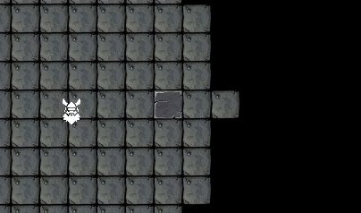

# Dwarfs Of Light
This is an implementation of a Entity Component System (ECS) based game engine, with a game built on top of it. The game is about dwarfs walking around in a dark cave with torches. The goal is to learn more about C++ containers, smart pointers, memory management, and hopefully templates.

## Problems Solved
- **Circular Dependancy** between `Game` and `Systems`, where both need to access the other's members. The solution was to tell the compiler how much memory to allocate in the header using a forward declaration. Then, with the implementation a simple `include` can be used, since the memory is already allocated and the circular dependancy is solved.
  - Only store pointer or reference to the other class.
  - `Game.h` includes `System.h` *outside* the include guards.
  - `System.h` forward declares `Game.h` above the header definition.
  - In the `System.cpp` source file `#include "Game.h"` right below the `#include "System.h`.
- **Collisions:** Designing a collision system for ECS isn't straight forward, seeing as different systems should be isolated. For example, an entity can have a `CollisionBox`-component. But where should it check collisions? If it's checked while moving it should be done in the `MovementSystem`, but then the `MovementSystem` will dependent on `CollisionBox` as well and not all entities that move will have a `CollisionBox`. Also, it will result in a `O(n^2)` instead of the possible `0.5*O(n^2)`. Therefore I have a `CollisionSystem` that executes *after* the `MovementSystem`. If a CollisionBox collides with another by overlapping, the system will move them apart again (using the shortest distance in one direction).
- **Storage of Entities, Components and Systems**:
  - **Entities** will be stored in a `std::list` in the `Game` class. This is good for random inserting, deleting and sorting. `Entities` will almost never be randomly accessed, and will typically be looped through with `iterators`, which is still fast. A possible downside is caching since the data won't be stored serially. However, the `Entity` only contains pointers to `components` (see next point), so it's already not great for caching. This list will also be sorted during rendering (for rendering order), which is very fast with `std::list` since it only changes pointers.
  - **Components** are currently stored in the `entity` it belongs to, in a `std::unorderer_map` of `std::unique_ptr`s. Storing it inside the `entity` is not ideal (see TODO #1), but was used for learn the ECS system. It's stored in a `std::unorderer_map` to have quick access by using a unique key (`ComponentTypeID`).
- **Light Rendering:** This is one of the main features of the game. Therefore it has a seperate heading, just scroll down.

## Detailed Descriptions

### Lighting Simulation

For this project I want to have the effect of a dwarf carrying a fire torch in a cave. Which means it will only light up the area around him, and cast a lot of shadows. Therefore, it would need some form of ray tracing to *not* light up blocks that's obscured. I saw two ways to achieve this.

#### Technique 1: Light Growing Algorithm

I thought a growing algorithm would suffuce, since the calculation will be done on large 2D discrete tiles. I've also always wanted to develop my own growing algorithm.

Therefore I defined a list of `Seeds`, which is only a tile coordinate. The first seeds is the light source tile, and each of it's neighbours. Then I will loop through this list of seeds and attempt to grow each one. A seed will only grow in certain conditions, and if creates more seeds successfully, then it's added to the main seed list. Then the main seed list is just looped until it's empty.

The initial rules I used was:
- New tile is not out of bounds of the map
- New tile has not already contain a seed
- New tile is within lighting distance from light source (do not like the squared distance calculation).

This works well enough, and only lights up the tiles within a certain distance. However, the light seems to bend around corners. This is due to the rough choice on which tiles are available to grow. This is visible in the two gifs below, where the dwarf-like entity is holding a light source.

**Please ignore the bad tileset colours.**

This is a good experiment, but for good looking lighting I believe the right way to go would be a form of ray tracing.

#### Technique 2: Discrete Ray Tracing

## TODO
1. Convert software to store data serially, which is one of the goals of ECS. For example, *all* `components` stored serially, with references to which `entity` they belong. The `systems` will then loop through the `components`, not caring to which `entity` it belongs to.

